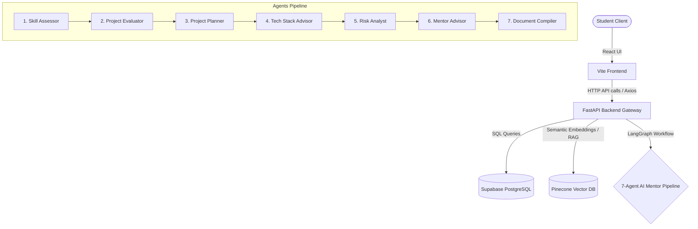

# AI Academic Mentor Portal

A full-stack, multi-agent AI mentoring portal designed for students to evaluate, plan, and architect their academic projects. 

This platform leverages **React** for a premium frontend experience, **FastAPI** as the backend API gateway, **Supabase (PostgreSQL)** for relational database storage, **Pinecone** for vector search indexing, and a **7-Agent LangGraph Pipeline** powered by **Google Gemini** for intelligent mentoring.

---

## 🏗️ System Architecture



---

## 🌟 Key Features

1. **Student Profiles & Authentication:** Secure JWT-based authentication for students to create accounts, customize settings, and view profile history.
2. **Interactive Skill Assessment:** Customized quiz assessment interface that maps student capabilities and dynamically updates their profile cards.
3. **End-to-End Onboarding:** Captures department, academic year, and initial project proposals in a premium split-screen interface.
4. **The 7-Agent Mentor Pipeline:** Launches a sequential AI workflow:
   * **Skill Assessment:** Evaluates skill alignment for the project.
   * **Project Evaluation:** Reviews feasibility, scope, and technical depth.
   * **Project Planning:** Formulates a week-by-week execution plan.
   * **Tech Stack:** Suggests optimal tools, frameworks, and database structures.
   * **Risk Analysis:** Anticipates potential blockers and provides mitigation strategies.
   * **Mentor Advice:** Provides high-level academic recommendations.
   * **Documentation Compiler:** Packages all output into a formal project proposal markdown.
5. **RAG-Injected Chat Workspace:** An interactive playground allowing students to upload PDFs (like grading rubrics or code templates) to Pinecone, enabling context-aware chat interactions with their AI Mentor.

---

## 🛠️ Technology Stack

* **Frontend:** React (18.2.0), Vite, Tailwind CSS, Axios, React Markdown.
* **Backend:** FastAPI, Uvicorn, Pydantic, Python-dotenv.
* **Orchestration:** LangGraph, LangChain, Google Gemini API, Groq API (fallback).
* **Vector Store:** Pinecone, SentenceTransformers (HuggingFace embeddings).
* **Database:** Supabase PostgreSQL database.

---

## 🔑 Prerequisites & Configuration

Before running the application, ensure you have **Python 3.10+** and **Node.js (v18+)** installed.

Create a `.env` file in the root directory with the following variables:

```env
SUPABASE_URL="https://your-supabase-project.supabase.co"
SUPABASE_KEY="your-supabase-anon-key"
HUGGINGFACE_API_KEY="your-huggingface-api-key"
PINECONE_API_KEY="your-pinecone-api-key"
PINECONE_INDEX_NAME="your-pinecone-index-name"
GROQ_API_KEY="your-groq-api-key"
GEMINI_API_KEY="your-google-gemini-api-key"
```

---

## 🚀 Installation & Running Guide

The frontend and backend are hooked together for a seamless developer experience. Running the frontend dev command will automatically boot up the backend FastAPI server as well.

### Step 1: Clone and Configure Environment
1. Clone the repository to your local machine.
2. Create and populate the `.env` file in the root directory.

### Step 2: Setup Python Virtual Environment
Open a terminal in the project root directory:

**Create Virtual Environment:**
```bash
python -m venv venv
```

**Activate Virtual Environment:**
* **Windows (PowerShell):**
  ```powershell
  .\venv\Scripts\Activate.ps1
  ```
* **macOS / Linux:**
  ```bash
  source venv/bin/activate
  ```

**Install Dependencies:**
```bash
pip install -r requirements.txt
```

### Step 3: Install Frontend Dependencies
```bash
cd frontend
npm install
```

### Step 4: Run the Application
You can launch both the frontend and backend servers simultaneously using a single command:

* **From the Project Root:**
  ```bash
  npm run dev
  ```
* **From the `/frontend` Directory:**
  ```bash
  npm run dev
  ```

#### How the Hook Works
The application uses the `concurrently` package defined in `frontend/package.json`:
* `vite` starts the React dev server (typically on `http://localhost:5173`).
* `cd .. && .\venv\Scripts\python.exe -m uvicorn api:app --reload` runs the FastAPI gateway server on `http://localhost:8000`.

---

## 📡 API Service Endpoints

The API is served at `http://localhost:8000`.

| Endpoint | Method | Description |
| :--- | :--- | :--- |
| `/` | `GET` | API Health and Home Endpoint |
| `/auth/register` | `POST` | Registers a new student account |
| `/auth/login` | `POST` | Logs in a student and returns a JWT |
| `/onboard` | `POST` | Submits onboarding profile, skills, and initial project idea |
| `/student/{id}` | `GET` | Fetches complete profile info for verification |
| `/initialize` | `POST` | Starts the 7-Agent LangGraph initialization pipeline |
| `/upload` | `POST` | Uploads PDF documents for Pinecone RAG semantic ingestion |
| `/chat` | `POST` | RAG-enabled chat interface with the AI Mentor |
| `/health/supabase`| `GET` | Verifies Supabase connection health |
| `/health/pinecone`| `GET` | Verifies Pinecone vector DB connection health |

---

## 🗄️ Database Schema

The database schemas are built in Supabase PostgreSQL database. You can locate the creation script in [schema.sql](file:///d:/ai-academic-project/backend/db/schema.sql).

1. **`student` Table:** Stores identity and authentication details (`student_id`, `name`, `email`, `password`, `department`, `year`).
2. **`skill_assessment` Table:** Tracks user competencies (`student_id`, `skills` array, `experience_level`, `score`).
3. **`project_idea` Table:** Holds project proposal parameters and references files ingested for RAG (`project_id`, `student_id`, `title`, `description`, `domain`, `status`, `uploaded_file_name`).
